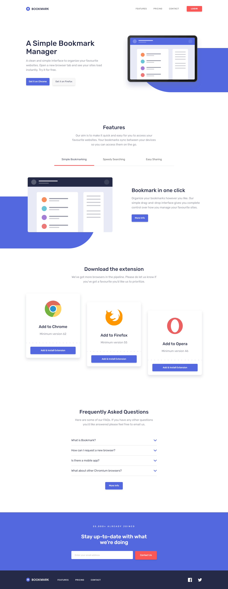

# Frontend Mentor - Bookmark landing page solution

This is a solution to the [Bookmark landing page challenge on Frontend Mentor](https://www.frontendmentor.io/challenges/bookmark-landing-page-5d0b588a9edda32581d29158). Frontend Mentor challenges help you improve your coding skills by building realistic projects. 

## Table of contents

- [Overview](#overview)
  - [The challenge](#the-challenge)
  - [Screenshot](#screenshot)
  - [Links](#links)
- [My process](#my-process)
  - [Built with](#built-with)
  - [What I learned](#what-i-learned)
  - [Continued development](#continued-development)
  - [Useful resources](#useful-resources)
- [Author](#author)

## Overview

### The challenge

Users should be able to:

- View the optimal layout for the site depending on their device's screen size
- See hover states for all interactive elements on the page
- Receive an error message when the newsletter form is submitted if:
  - The input field is empty
  - The email address is not formatted correctly

### Screenshot



### Links

- Solution URL: [https://github.com/Yejin-Han/Bookmark-landing-page-master](https://github.com/Yejin-Han/Bookmark-landing-page-master)
- Live Site URL: [https://yejin-han.github.io/Bookmark-landing-page-master/](https://yejin-han.github.io/Bookmark-landing-page-master/)

## My process

### Built with

- Semantic HTML5 markup
- CSS custom properties
- Flexbox
- CSS Grid
- Mobile-first workflow
- [Styled Components](https://styled-components.com/) - For styles

### What I learned

svg를 이미지로 받았을 때, 색상 변경하는 방법 -> 그냥 svg를 edge 등으로 열어 코드를 확인하고 안에서 path 등의 색상을 변경.
viewbox
form checkValidity, setCustomValidity method
aria 속성을 이용한 tab


```html
<h1>Some HTML code I'm proud of</h1>
```
```css
.proud-of-this-css {
  color: papayawhip;
}
```
```js
const proudOfThisFunc = () => {
  console.log('🎉')
}
```

### Continued development

- svg에 대한 더 자세한 활용 방법
- illustration에 배경까는 부분이 계속 어색함


### Useful resources

- [Resource 1](https://velog.io/@teo/2022-CSS-Reset-%EB%8B%A4%EC%8B%9C-%EC%8D%A8%EB%B3%B4%EA%B8%B0) - Reorganize CSS Reset. I have organized only what I felt necessary while studying and working so far.
- [Resource 2](https://nuucolog.tistory.com/27) - SVG viewbox, width, height
- [Resource 3](https://keithjgrant.com/posts/2023/04/transitioning-to-height-auto/) - SlideUp/Down with CSS grid, 내용에 padding 등이 필요하다면 transition 조종되는 div 말고 안에 extra div를 만들어서 padding 입혀줌.
- [Resource 4](https://www.geeksforgeeks.org/form-required-attribute-with-a-custom-validation-message-in-html5/) - form checkValidity, setCustomValidity method


## Author

- Github - [Yejin Han(한예진)](https://github.com/Yejin-Han)
- Frontend Mentor - [@Yejin-Han](https://www.frontendmentor.io/profile/Yejin-Han)